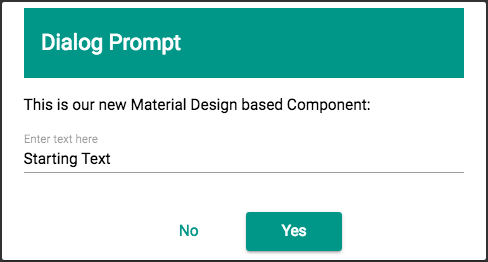
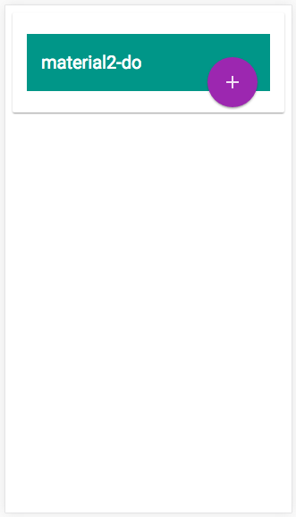
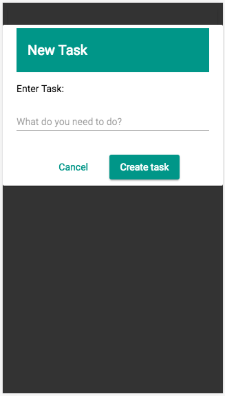
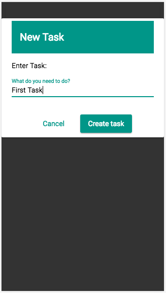
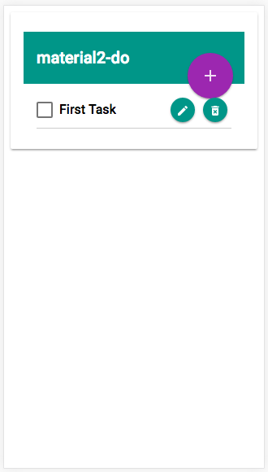
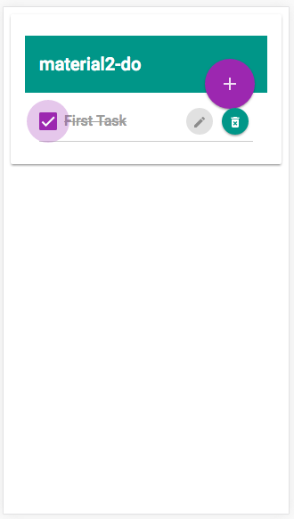
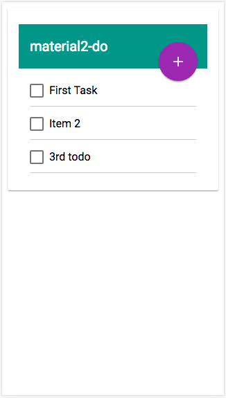

# Material Todo

This project was generated with [angular-cli](https://github.com/angular/angular-cli) version 1.0.0-rc.2 and uses [Material Design ^2.0.0-beta.2](https://github.com/angular/material2). 

The code in this repository is available under the MIT License.

## Install & Serve
To get started, you will need node & npm installed. Type the following:

    npm install && npm start
                                
This will install all the necessary node packages and start the server on port 4200

You should be able to see the app running at [http://localhost:4200]()

The article below (and graphics) were originally produced for [Net Magazine]
(http://www.creativebloq.com/net-magazine), and now adheres to a Creative Commons 
Licence ([CC BY-NC](https://en.wikipedia.org/wiki/Creative_Commons_license)), and may 
be used for Non-Commercial use with attribution.

##### About the Author
Daniel Zen  
**W:** zen.digital  
**T:** @danielzen  
**Job:** Chief Instruction Officer  
**area of expertise:** Agile JavaScript Training

# Build An Angular Material App
## Daniel Zen walks through creating a DialogComponent & ToDo app with Angular Material and the Angular CLI
GitHub URL: [https://github.com/danielzen/material-todo](https://github.com/danielzen/material-todo)


Angular Material ([material.angular.io](http://material.angular.io)) is UI Component framework which implements Google’s Material Design Specification for the latest version of Angular. Although still in beta, Angular Material provides a set of reusable and accessible UI components based on Material Design.

Angular itself has many new technologies in the most recent version. At the JavaScript level we have the additional syntax of [EcmaScript 2015](http://www.ecma-international.org/ecma-262/6.0/) (ES6), typing and interface support from [TypeScript](http://www.typescriptlang.org/), along with [Decorators](https://angular.io/docs/ts/latest/guide/glossary.html#!#decorator) an experimental JavaScript feature implemented in TypeScript. It also uses and supports [`Observables`](http://reactivex.io/documentation/observable.html) from the [Reactive Extensions Library (RxJS)](http://reactivex.io/rxjs/) to manage sequences of events in a functional programming way. It uses [`Zones`](https://github.com/angular/zone.js) to encapsulate and intercept asynchronous activity and provide a form of thread-local storage. This allows Angular to auto-magically respond to data changes in asynchronous events to maintain [data bindings](https://angular.io/docs/ts/latest/guide/glossary.html#!#data-binding). Finally, module loading is handled by [WebPack](https://webpack.js.org). 

In this tutorial we are going to use Angular to create a simple to-do app with some signature Material Design elements.

### Get Set Up
Setting up an initial environment can be difficult. There were efforts to create a seed or starter. However, there is something even better. With the [Angular CLI](https://cli.angular.io/) you can configure your Angular project with a single command. 

Not only will it take care of all of setup for all of the technologies mentioned above (via Node & npm), it will also add in scaffolding for [Jasmine](http://jasmine.github.io/2.4/introduction.html) Unit Testing, [Protractor](http://www.protractortest.org/) end-to-end testing, plus [TSLint](https://palantir.github.io/tslint/). And [Codelyzer](https://github.com/mgechev/codelyzer) for static code analysis and additional linting for best practices in your Angular Project. Although you don’t have to use all these, you definitely should. It's so simple to setup, you will wonder how you ever got along without it.

Angular CLI is available as an npm package, so you will need to have Node and npm installed on your machine. Remember to install the angular-cli globally with the -g option: `npm install -g @angular/cli`. Now create a new Angular app with `ng new material-todo`.

You are going to have to wait a little bit because after it generates the necessary files, it initializes a Git repo and does an `npm install` to download all the necessary modules into `node_modules/`. Take a look at the tree structure and `package.json` file. Get familiar with the modules and scripts there.

You have now created a new Angular application that follows the official [Style Guidelines](https://angular.io/docs/ts/latest/guide/style-guide.html).

#### Add Material Design
The default app knows nothing about Material Design (an oversight I’m sure). So we have to add it ourselves. You’ll find the full instructions at (https://github.com/angular/material2/blob/master/guides/getting-started.md). 

There are many Angular Material Design components and features in the `@angular/material` library. Let's install it:

`npm install --save @angular/material`

##### Import the Angular Material NgModule
To use it in our project in `src/app/app.module.ts` add the `MaterialModule`:

```typescript
import { MaterialModule } from '@angular/material';
// other imports 
@NgModule({
  imports: [MaterialModule],
  ...
})
export class AppModule { }
```

##### Material Design Theme & Icons
Angular Material comes prepackaged with several pre-built theme css files. These theme files also include all of the styles for core (styles common to all components), so you only have to include a single css file for Angular Material in your app. This is as simple as including one line in your `src\styles.css` file:

```css
@import '~@angular/material/core/theming/prebuilt/deeppurple-amber.css';
```

We want to use Material Design icons, so let's load the Material Design font in `src/index.html`. Any font can work, but we are using the standard Material Design icons. Add the following to the `<head>`:

```html
<link href="https://fonts.googleapis.com/icon?family=Material+Icons" rel="stylesheet">
```

Now we can work with Material Design in our Angular app.

### DialogComponent
One of the components available in Angular Material Design is a `Dialog`. However, we are going to create our own! It will give more insite by easily composing this new Component using the Material Design Components `md-card` and `md-toolbar`, as well as an `input` and couple of `button`s with Material Design directives to give them the proper look and feel. Make sure you are in the `src/app` folder of your repo and do the following from your command line:

`ng generate component dialog`

This has generated a new `DialogComponent` in the `src/app/dialog` folder. It has also updated our `app.module.ts` to include the new component in the default `NgModule` of our application. 

If you look at the generated `dialog.component.ts` file, you will see the first line is:
```typescript
import { Component, OnInit } from '@angular/core';
```

`Component` is one of the main building blocks of Angular, and `OnInit` is one of the interfaces that it implements. However, In order to have access to [Component Communication](https://angular.io/docs/ts/latest/cookbook/component-communication.html) between nested components, as well as the Material Design components mentioned above, we will need to import `Input`, `Output` & `EventEmitter` from `@angular/core`. 

We then declare a number of `@Input` variables (`okText`, `cancelText`, etc.) that allow us to define the contents of the DialogComponent, and one `@Output` emitter, that allows us to trigger a function in the parent component with a value when the dialog is closed.

Now we can replace the generated constructor in `dialog.component.ts` with the following code:

```typescript
constructor() {
 this.okText = 'OK';
 this.cancelText = 'Cancel';
}

emitValue(value) {
 this.valueEmitted.emit(value);
}
```

We will use the `@Input` variables inside our DialogComponent in the `dialog.component.html` template. The Material Design `md-input-container`  component, along with the `mdInput` directive, styles the standard html `input` which allows us to accept input from the user:

```html
  <md-input-container class="full-width">
    <input mdInput [placeholder]="placeholder"
            [(ngModel)]="value"
            (keyup.enter)="emitValue(value)"
            (keyup.escape)="emitValue(null)"/>
  </md-input-container>
```                

Users can also click buttons "OK" or "Cancel", which can be relabeled by changing `okText` or `cancelText`:
 
```html
<button md-button (click)="emitValue(null)" color="primary">
  {{cancelText}}
</button>
<button md-raised-button (click)="emitValue(value)" color="primary">
  {{okText}}
</button>
```

Notice the `keyup` event handlers which take care of thinks when the enter or escape key is pressed. These handlers are identical to the `click` event handlers for `cancelText` and `okText`. Escape does the same thing as cancel (`emitValue(null)`), and typing enter will do the same thing as clicking OK (`emitValue(value)`). This allows us to prompt the user for a `value` via an `input` and receive emitted output. 

We also added some CSS in `dialog.component.css`, in order to achieve the layout we desire – you can view the full code in the accompanying GitHub repo.

Now let’s add this `DialogComponent` to our `AppComponent` to see what it looks like. Replace the contents of `src/app/app.component.html` with: 

```html
<app-dialog [title]="'Dialog Prompt'"
            [template]="'This is our new Material Design based Component:'"
            [placeholder]="'Enter text here'"
            [okText]="'Yes'"
            [cancelText]="'No'"
            [value]="'Starting Text'"
            (valueEmitted)="log($event)"
            [showPrompt]="true">
</app-dialog>
```

Notice, we have literal strings for all of the `@Input`'s. When we use the square bracket syntax `[title]` we are required to use both single and double quotes, otherwise Angular interprets the contents as a JavaScript variable in the `DialogComponent` scope. In addition, we have the `valueEmitted` `@Output`. The DialogComponent is simple, and extremely configurable. Most of the Inputs would have defaulted to empty strings if omitted. 

Now, let’s modify `AppComponent`, replace the contents of the `class`:

```typescript
export class AppComponent {
  log(text) {
    console.log(text);
  }
}
```

Let’s take a look at our handiwork. If you haven’t already, you can serve up the app (the default port is 4200) by running:

`npm run-script start`  # which in turn runs `ng server`

You should see the following:



If you open up the console, you can what is logged: The contents of the input is emitted when you click “Yes”, and `null` is emitted when you click “No”.

We are now ready to use this new DialogComponent to create our MaterialTodo app.

#### material-todo AppComponent:
We are going to finish up our app by using the following Material Design Components for the main app: **toolbar**, **list**, **list-item**, **checkbox**, **button**, and **icon**.

We are going to leverage our `DialogComponent`, adding in enough logic for a simple ToDo application. The two main functions `todoDialog` & `updateTodo` deal with opening and closing the dialog.

The `todoDialog` gets called to open our dialog either with the task to edit (`todo`), or null if we are creating a new task. We set up the defaults variables for a new task, but change them if accordingly if we are instead editing a task. 
We then show the `DialogComponent` by setting the `showDialog` variable to `true`:

```typescript
  todoDialog(todo = null) {
    this.okButtonText = 'Create task';
    this.fieldValue = '';
    this.editingTodo = todo;
    if (todo) {
      this.fieldValue = todo.title;
      this.okButtonText = 'Edit task';
    }
    this.showDialog = true;
  }
```

The `updateTodo` function will get called when we wish to close it. And the other functions, `editTodo`, `addTodo`, & `hideDialog` are helper methods for `updateTodo`.

```typescript
  updateTodo(title) {
    if (title) {
      title = title.trim();
      if (this.editingTodo) {
        this.editTodo(title);
      } else {
        this.addTodo(title);
      }
    }
    this.hideDialog();
  }
```

In `app.component.html` we've given our application a `md-toolbar` where we have put the title, and an `md-icon` called 'add', which looks like a plus-sign (+) for our floating action button (FAB) which allows us to create a new task: 

```html
    <button md-fab class="fab-add" (click)="todoDialog()">
      <md-icon>add</md-icon>
    </button>
```

We use `md-card-content` to hold an `md-list`. And, an `*ngFor` to iterate through, and display, our `todoList` array as `md-list-item`'s:
 
```html
      <md-list-item *ngFor="let todo of todoList; let index=index">
```

We use an `md-checkbox` to allow us to tick off items on our list. And we have two `md-mini-fab` buttons, using `md-icon`s 'delete\_forever' & 'mode\_edit', that we can use to delete and edit our task:

```html
<button md-mini-fab (click)="remove(index)" color="primary">
  <md-icon>delete_forever</md-icon>
</button>

<button md-mini-fab (click)="todoDialog(todo)" color="primary"
        [disabled]="todo.completed">
  <md-icon>mode_edit</md-icon>
</button>
```

They remain hidden until you rollover (or click on mobile) with a little CSS, which you can view in the repo. Check out some images of the the app in action:









Keep in mind that Angular Material is still in beta, but ther will likely be no more breaking changes to the API. It is very much functioning and lives up to the claim of having a straightforward API that doesn't confuse developers. It was easy to leverage for the creation of a great looking app. Thanks go out to Jeremy Elbourn, Kara Erickson, Andrew Seguin, Paul Gschwendtner, Kristiyan Kostadinov, and all of the other contributors for their efforts.
