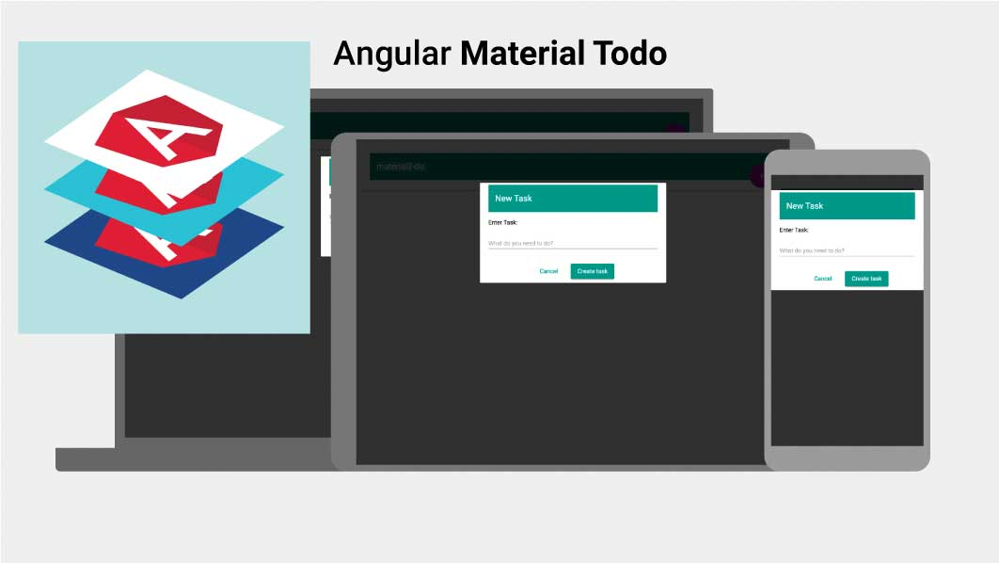

# Material Todo

This project was generated with [angular-cli](https://github.com/angular/angular-cli) version 1.0.0-beta.15 and uses [Material Design ^2.0.0-alpha.9](https://github.com/angular/material2)

## Install & Serve
To get started, you will need node & npm installed. Type the following:

    npm install && npm start
                                
This will install all the necessary node packages and start the server on port 4200

You should be able to see the app running at [http://localhost:4200]()

## Running unit tests

There are some unit tests:

Run `ng test` to execute the unit tests via [Karma](https://karma-runner.github.io).

## Running end-to-end tests

The Protractor tests are not currently up to date:

Run `ng e2e` to execute the end-to-end tests via [Protractor](http://www.protractortest.org/). 
Before running the tests make sure you are serving the app via `ng serve`.

## Deploying to Github Pages

Run `ng github-pages:deploy` to deploy to Github Pages.

## Further help

To get more help on the `angular-cli` use `ng --help` or go check out the [Angular-CLI README](https://github.com/angular/angular-cli/blob/master/README.md).
